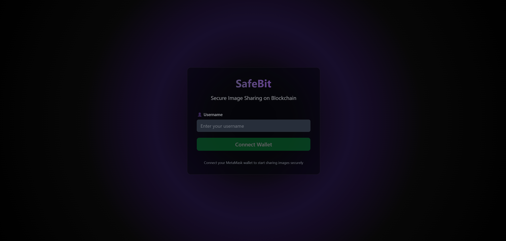
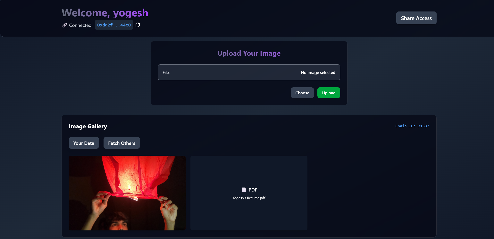

# SafeBit

SafeBit is a Web3-based file-sharing DApp built using React and Solidity.<br> It lets users upload files and securely share access to them via the blockchain.<br> Everything runs on smart contracts and IPFS (no centralized server needed).

## About

This is a college-level project made for learning and demonstration purposes. It allows users to:

- Connect their MetaMask wallet
- Upload files to IPFS
- Store and share access via smart contracts
- View personal and shared files
- Use a simple and modern UI with React and TailwindCSS

Currently, only local-host is supported. Working on deploying it on polygon.

> You’ll need MetaMask installed and connected to a testnet like Goerli.

Here’s a preview of the dApp:  


<br>

## Tech Stack

### Frontend
- React
- Vite
- TailwindCSS
- Ethers.js

### Backend 
- Solidity Smart Contract (`Upload.sol`)
- Hardhat for deployment
- IPFS (via Lighthouse(NFT.storage) As well as Pinata)

## Pre-requisites
```bash
Initialize metamask account with hardhat testnet
Then Initialize a .env file with API token and secret
```

## Installation

```bash
npm install
```

#### To deploy the smart contract (in Hardhat):

```bash
npx hardhat run scripts/deploy.js --network localhost
```
```bash
npx hardhat node
```

## Local Development
To run the frontend:

```bash
npm run dev
```

### Notes
- You need to configure .env with your Pinata API keys and contract addresses.
- For testing, use Hardhat local network or Goerli.
